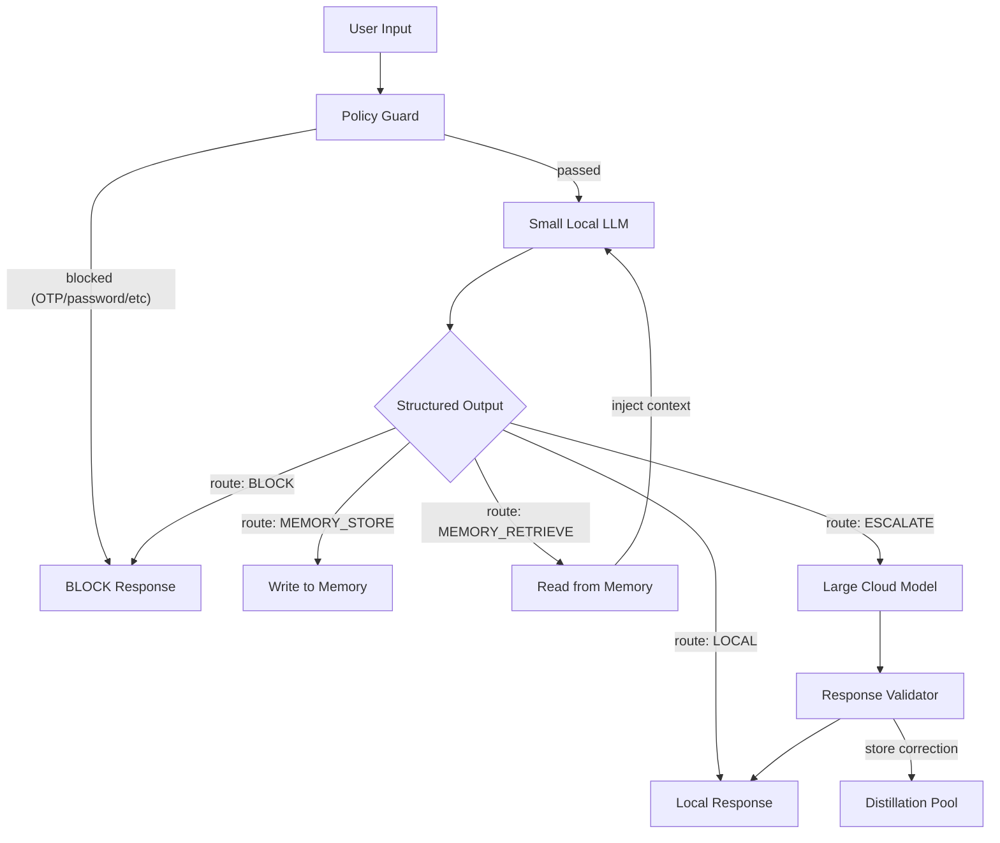

# Smart Local LLM Roadmap — Making Small Models Smart with A-S-FLC

Persistent reference for objectives and staged delivery. Last updated: 2026-03-28.

## Goal

Fine-tune a 1.5B-3B parameter model that runs locally on a phone and can:

1. Produce structured A-S-FLC decisions (asymmetric scoring, event chains, stability)
2. Classify security threats (scams, phishing, injection, fraud)
3. Manage its own memory (store, retrieve, skip)
4. Know when to escalate to a large cloud model
5. Learn from large-model corrections over time

## Current State

- **GitHub**: https://github.com/denial-web/a-s-flc-llm-enhancer
- **HuggingFace Dataset**: https://huggingface.co/datasets/denialkhmbot/a-s-flc-decisions
- **Framework**: Core A-S-FLC with 5 modes (single-shot, what-if, hybrid, security, memory)
- **Training Data**: See `training/dataset/` and `training/eval_split.json` for train/eval splits
- **Policy Guard**: Deterministic pre-LLM rules in `core/policy_guard.py`
- **Memory Store**: SQLite + FAISS semantic search in `core/memory_store.py`
- **Cloud Bridge**: Escalation to large models in `core/cloud_bridge.py`
- **Distillation**: Correction pair collection in `core/distillation.py`
- **Deployment**: GGUF export + mobile config in `deployment/`

## Architecture

The small model is the decision-maker. Everything else is deterministic code.

## Output Schema Contract

**Stage 1a (A-S-FLC):** `chosen_action`, `breakdown`, `all_chains`, `reasoning_steps`, `stability_score`.

**Stage 1b (security):** optional `risk_level` (SAFE | SUSPICIOUS | DANGEROUS), `threat_type`, `decision_route` (LOCAL | BLOCK).

**Stage 2 (memory + routing):** extended `decision_route` (MEMORY_STORE | MEMORY_RETRIEVE | ESCALATE), `memory_action`, `knowledge_request`.

**Stage 3 (escalation):** `escalation_reason`, `source` (small | large_knowledge).

See `core/types.py` for the canonical Pydantic schema.

---

## Stage 1a — A-S-FLC Format Fine-Tune ✅

- ✅ Fix known-bad rows in dataset (scam-iPhone case, sec-mal-012 QR code).
- ✅ Use `training/eval_split.json` for held-out eval IDs (never train on these).
- ✅ Fine-tune with `training/finetune_colab.ipynb` (Unsloth + Qwen2.5-1.5B, assistant-only loss).
- **Done when:** >= 90% valid JSON on held-out set.

## Stage 1b — Security Classification ✅

- ✅ Security prompt: `inference/fg_cot_prompt.py` (`SECURITY_*`).
- ✅ Inference: `A_S_FLC_Wrapper.decide_security()` in `inference/wrapper.py`.
- ✅ Dataset: `training/security_query_bank.json` (200 queries) + `python training/generate_dataset.py --mode security`.
- ✅ Policy Guard: `core/policy_guard.py` runs before the model.

## Stage 2 — Memory and Routing ✅

- ✅ Memory store: `core/memory_store.py` (SQLite + FAISS/NumPy, sentence-transformer embeddings).
- ✅ Memory prompt: `inference/fg_cot_prompt.py` (`MEMORY_*`).
- ✅ Inference: `A_S_FLC_Wrapper.decide_memory()` in `inference/wrapper.py`.
- ✅ Query bank: `training/memory_query_bank.json` (90 queries: store/retrieve/skip/escalate/mixed).
- ✅ Dataset generation: `python training/generate_dataset.py --mode memory`.
- ✅ Full pipeline: `A_S_FLC_Wrapper.decide_full()` — policy guard → model → escalation.

## Stage 3 — Escalation and Distillation ✅

- ✅ Cloud bridge: `core/cloud_bridge.py` (OpenAI/Anthropic/Groq, escalation prompt).
- ✅ Response validator: `core/response_validator.py` (structural + logical checks, quality scoring).
- ✅ Distillation pool: `core/distillation.py` (JSONL correction pairs, chat-format export).
- ✅ Auto-escalation: wrapper's `_maybe_escalate()` forwards ESCALATE decisions to cloud bridge.
- ✅ Auto-distillation: corrections saved when large model output > small model output quality.

## Stage 4 — Mobile Deployment ✅

- ✅ GGUF export: `deployment/export_gguf.py` (Q4_0, Q4_K_M, Q5_K_M, Q8_0, F16).
- ✅ Mobile config: `deployment/mobile_config.py` (device tiers, performance budgets, inference params).
- ✅ Local inference: `deployment/local_inference.py` (llama-cpp-python runner with policy guard + validation).

## First Training Run — Eval Results (2026-03-29)

**Config:** Qwen2.5-1.5B, QLoRA r=16, 500 steps (~8 epochs), 448 train / 20 eval, Groq Llama 3.3 70B teacher.

**Training loss:** 2.4 → 0.05 (converged well).

**Local inference (MacBook, Q4_K_M GGUF, 940MB):**

| Test | Mode | Valid JSON | Quality | Speed | Notes |
|------|------|-----------|---------|-------|-------|
| Job offer decision | single | ✅ | 0.90 | 53 tok/s | Correct scoring, 4 reasoning steps |
| Investment 3-way | single | ❌ | — | 53 tok/s | Good reasoning but JSON truncated at 425 tokens |
| Tax/IRA analysis | single | ✅ | 0.90 | 55 tok/s | Correctly chose ESCALATE route |
| Phishing email | security | ❌ | — | 25 tok/s | Correct SUSPICIOUS+BLOCK but wrong schema |
| Allergy memory | memory | ❌ | — | 34 tok/s | Correct STORE route but simplified schema |
| Lottery gift card | security | BLOCKED | N/A | instant | Policy Guard caught it pre-model |

**Strengths:** Core A-S-FLC decisions are solid; policy guard works; escalation routing works; 53+ tok/s on Mac.

**Weaknesses:** Security and memory modes produce simplified JSON (not full DecisionOutput schema); long queries can truncate.

**Next improvements:**
- [ ] Add more security/memory examples with full DecisionOutput schema to training data.
- [ ] Increase `max_new_tokens` for complex multi-option queries.
- [ ] Run full 20-ID eval harness for precise valid-JSON percentage.
- [ ] Test on actual mobile device (iPhone/Android).

## Completed Milestones

- [x] Run fine-tuning on Colab Pro (500 steps, T4 GPU, loss 0.05).
- [x] Generate memory training pairs (90 pairs via Groq).
- [x] Upload expanded dataset to HuggingFace (468 examples).
- [x] Export GGUF on Colab (Q4_K_M, 940MB).
- [x] Test on-device inference with llama-cpp-python (53+ tok/s on Mac).

## What NOT to Build Yet

- Anti-poisoning at scale, cross-user detection, Khmer-first training, full web UI.

## File Map

| File | Purpose |
|------|---------|
| `core/types.py` | DecisionOutput + security + memory fields |
| `core/policy_guard.py` | Deterministic rule engine |
| `core/memory_store.py` | SQLite + FAISS memory store |
| `core/cloud_bridge.py` | Escalation to large cloud models |
| `core/response_validator.py` | Output validation + quality scoring |
| `core/distillation.py` | Correction pair collection for re-fine-tuning |
| `inference/fg_cot_prompt.py` | FG-CoT, What-If, Security, Memory prompts |
| `inference/wrapper.py` | decide, decide_whatif, decide_hybrid, decide_security, decide_memory, decide_full |
| `training/query_bank.json` | General query bank (178 queries) |
| `training/security_query_bank.json` | Security query bank (200 queries) |
| `training/memory_query_bank.json` | Memory/routing query bank (90 queries) |
| `training/generate_dataset.py` | single / whatif / security / memory modes |
| `training/eval_split.json` | Held-out eval IDs |
| `training/finetune_colab.ipynb` | Colab fine-tuning (dataset load, eval split, SFTTrainer, assistant-only loss, save LoRA) |
| `training/format_for_hf.py` | Format + merge datasets for HuggingFace |
| `training/upload_to_hf.py` | Upload to HuggingFace Hub |
| `deployment/export_gguf.py` | LoRA → GGUF export (Unsloth) |
| `deployment/mobile_config.py` | Device tiers, performance budgets |
| `deployment/local_inference.py` | llama-cpp-python local runner |
| `SECURITY_ADAPTER.md` | Security + A-S-FLC architecture |
| `ROADMAP.md` | This file |
