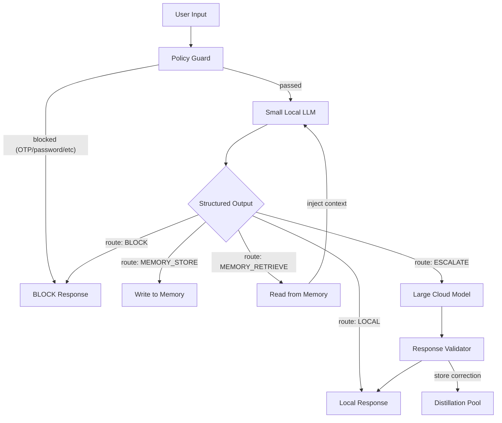

# Smart Local LLM Roadmap — Making Small Models Smart with A-S-FLC

Persistent reference for objectives and staged delivery. Last updated: 2026-03-27.

## Goal

Fine-tune a 1.5B-3B parameter model that runs locally on a phone and can:

1. Produce structured A-S-FLC decisions (asymmetric scoring, event chains, stability)
2. Classify security threats (scams, phishing, injection, fraud)
3. Manage its own memory (store, retrieve, skip)
4. Know when to escalate to a large cloud model
5. Learn from large-model corrections over time

## Current State

- **GitHub**: https://github.com/denial-web/a-s-flc-llm-enhancer
- **HuggingFace Dataset**: https://huggingface.co/datasets/denialkhmbot/a-s-flc-decisions
- **Framework**: Core A-S-FLC with 3 modes (single-shot, what-if, hybrid), validation suite
- **Training Data**: See `training/dataset/` and `training/eval_split.json` for train/eval splits
- **Policy Guard**: Deterministic pre-LLM rules in `core/policy_guard.py`

## Architecture

The small model is the decision-maker. Everything else is deterministic code.

## Output Schema Contract

**Stage 1a (A-S-FLC):** `chosen_action`, `breakdown`, `all_chains`, `reasoning_steps`, `stability_score`.

**Stage 1b (security):** optional `risk_level` (SAFE | SUSPICIOUS | DANGEROUS), `threat_type`, `decision_route` (LOCAL | BLOCK).

**Stage 2 (memory + routing):** extended `decision_route`, `memory_action`, `knowledge_request`.

**Stage 3 (escalation):** `escalation_reason`, `source`.

See `core/types.py` for the canonical Pydantic schema.

---

## Stage 1a — A-S-FLC Format Fine-Tune

- Fix known-bad rows in dataset (e.g. scam-iPhone case).
- Use `training/eval_split.json` for held-out eval IDs (never train on these).
- Fine-tune with `training/finetune_colab.ipynb` (Unsloth + Qwen2.5-1.5B).
- **Done when:** >= 90% valid JSON on held-out set.

## Stage 1b — Security Classification

- Security prompt: `inference/fg_cot_prompt.py` (`SECURITY_*`).
- Inference: `A_S_FLC_Wrapper.decide_security()` in `inference/wrapper.py`.
- Dataset: `training/query_bank.json` (security category) + `python training/generate_dataset.py --mode security`.
- Policy Guard: `core/policy_guard.py` runs before the model.

## Stage 2 — Memory and Routing

- Extend schema and prompts; memory store (SQLite + FAISS) — planned.

## Stage 3 — Escalation and Distillation

- Cloud bridge, validation, correction pairs, periodic re-fine-tune — planned.

## Stage 4 — Mobile Deployment

- Qwen2.5-1.5B Q4, GGUF/llama.cpp, latency and RAM targets — planned.

## What NOT to Build Yet

- Anti-poisoning at scale, cross-user detection, Khmer-first training, full web UI.

## File Map

| File | Purpose |
|------|---------|
| `core/types.py` | DecisionOutput + security fields |
| `core/policy_guard.py` | Deterministic rule engine |
| `inference/fg_cot_prompt.py` | FG-CoT, What-If, Security prompts |
| `inference/wrapper.py` | decide, decide_whatif, decide_hybrid, decide_security |
| `training/query_bank.json` | Query bank |
| `training/generate_dataset.py` | single / whatif / security modes |
| `training/eval_split.json` | Held-out eval IDs |
| `training/finetune_colab.ipynb` | Colab fine-tuning (dataset load, eval split, SFTTrainer, save LoRA) |
| `SECURITY_ADAPTER.md` | Security + A-S-FLC architecture |
| `ROADMAP.md` | This file |
